# AIOps — Insurance Document Classifier: Technical Documentation

> A browser-based machine-learning application that automatically classifies insurance documents by category and subcategory using several interchangeable ML algorithms.

---

## Table of Contents

1. [Project Overview](#1-project-overview)
2. [Technology Stack](#2-technology-stack)
3. [High-Level Architecture](#3-high-level-architecture)
4. [Module Breakdown](#4-module-breakdown)
   - 4.1 [Entry Point — `app.py`](#41-entry-point--apppy)
   - 4.2 [Document Processor — `src/document_processor.py`](#42-document-processor--srcdocument_processorpy)
   - 4.3 [Feature Extractor — `src/feature_extractor.py`](#43-feature-extractor--srcfeature_extractorpy)
   - 4.4 [Classifier — `src/classifier.py`](#44-classifier--srcclassifierpy)
   - 4.5 [Storage — `src/storage.py`](#45-storage--srcstorагepy)
   - 4.6 [Defaults — `src/defaults.py`](#46-defaults--srcdefaultspy)
5. [Data Flows](#5-data-flows)
   - 5.1 [Training Flow](#51-training-flow)
   - 5.2 [Prediction Flow](#52-prediction-flow)
6. [ML Pipeline Architecture](#6-ml-pipeline-architecture)
7. [Data Model](#7-data-model)
8. [UI Application Structure](#8-ui-application-structure)
9. [Directory Structure](#9-directory-structure)
10. [Configuration & Deployment](#10-configuration--deployment)
11. [Feature Engineering Deep Dive](#11-feature-engineering-deep-dive)
12. [Classification Algorithms Compared](#12-classification-algorithms-compared)
13. [Error Handling & Edge Cases](#13-error-handling--edge-cases)
14. [Extension Points](#14-extension-points)

---

## 1. Project Overview

AIOps is a self-contained **Insurance Document Classification System** built with Python and Streamlit. It solves a common problem in the insurance industry: incoming documents (PDFs, Word files, spreadsheets, scanned images) must be routed to the correct processing queue based on their type. Manual sorting is slow and error-prone; this application lets a small team train a custom ML model on their own labeled documents and immediately use it to classify new ones — with no external APIs, no cloud dependencies, and no data leaving the local machine.

### What it does

| Capability | Detail |
|---|---|
| Document ingestion | Reads PDF, DOCX/DOC, XLSX/XLS, and raster images (PNG, JPG, TIFF, BMP, GIF) |
| Text extraction | Native parsing for office formats; OCR (Tesseract) for scanned images |
| Hierarchical labeling | Two-level taxonomy: **Category** → **Subcategory** (e.g., Claims → Medical Records) |
| Model training | Four interchangeable scikit-learn algorithms with cross-validation |
| Prediction | Top-5 ranked predictions with probability scores per document |
| Explainability | Confidence indicator, class distribution chart, confusion matrix |
| Persistence | Training data in JSON; trained model serialized via joblib |

### Core User Workflow

```
1. Upload labeled documents  →  2. Train a model  →  3. Upload unknown doc  →  4. Get classification
```

---

## 2. Technology Stack

```
Language:       Python 3.14+
UI Framework:   Streamlit ≥ 1.35
ML:             scikit-learn ≥ 1.4  (pipelines, TF-IDF, algorithms, cross-validation)
Numerics:       NumPy ≥ 1.26 · pandas ≥ 2.0
Document I/O:   pdfplumber ≥ 0.10  · python-docx ≥ 1.1  · openpyxl ≥ 3.1
Image OCR:      Pillow ≥ 10.0  · pytesseract ≥ 0.3  (+ system Tesseract binary)
Serialization:  joblib ≥ 1.3
Visualization:  matplotlib ≥ 3.8  · seaborn ≥ 0.13
```

---

## 3. High-Level Architecture

The system is a **monolithic single-process Streamlit application**. There is no separate backend API, no database server, and no message queue. All components run in-process; state is held in Streamlit's session state (in-memory) and on disk (JSON + joblib files).

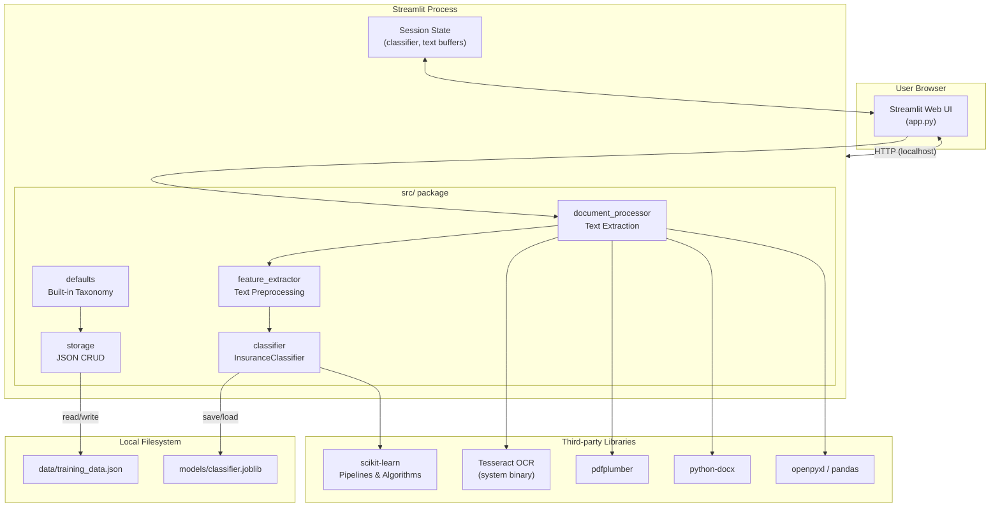

---

## 4. Module Breakdown

### 4.1 Entry Point — `app.py`

`app.py` is the **orchestration layer**. It owns the Streamlit page layout and wires all `src/` modules together. It never contains business logic; it delegates everything to the appropriate module.

**Responsibilities:**
- Configure Streamlit page (`set_page_config`)
- Initialize session state (load classifier from disk on first run)
- Render the three-page navigation via `st.sidebar`
- Handle all user interactions (file uploads, button clicks, selects)
- Display results, charts, and tables

**Key globals:**
```python
MODEL_PATH = "models/classifier.joblib"   # serialized model location
```

**Pages rendered:**

| Page | Sidebar Label | Purpose |
|---|---|---|
| Train | 🏋️ Train | Upload + label documents, manage dataset, trigger training |
| Test / Predict | 🔍 Test / Predict | Upload a new document, run classification, view ranked results |
| Model Info | 📊 Model Info | Dashboard with metrics, class distribution chart, confusion matrix |

---

### 4.2 Document Processor — `src/document_processor.py`

Handles **text extraction** from all supported file formats. Acts as a format-agnostic adapter: callers only use `extract_text(bytes, filename)` and receive a plain string regardless of the source format.

**Supported formats:**

```python
SUPPORTED_EXTENSIONS = {
    ".pdf", ".docx", ".doc", ".xlsx", ".xls",
    ".png", ".jpg", ".jpeg", ".tiff", ".tif", ".bmp", ".gif",
}
```

**Internal dispatch:**

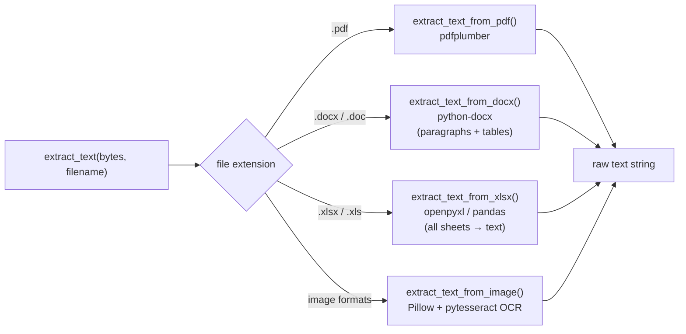

**DOCX table handling:** table cells are joined with `" | "` separators and appended after paragraph text, ensuring tabular data in claims forms or policies is not silently dropped.

**XLSX handling:** every sheet is iterated; column headers and all non-empty cell values are linearized into a `Sheet: <name>\ncol1 | col2 | …\nval1 | val2 | …` text block.

**OCR dependency:** `extract_text_from_image` requires the system-level Tesseract binary. If it is missing the function raises a `RuntimeError` with installation instructions for macOS, Ubuntu, and Windows.

---

### 4.3 Feature Extractor — `src/feature_extractor.py`

Converts raw extracted text into the feature string fed to the ML pipeline. Three functions:

| Function | Input | Output | Purpose |
|---|---|---|---|
| `preprocess_text(text)` | raw str | normalized str | lowercase, strip non-alphanumeric chars, collapse whitespace |
| `prepare_single_text(text, keywords)` | raw str + keyword list | feature str | preprocess + append keywords repeated ×3 for TF boost |
| `prepare_training_texts(samples)` | list of sample dicts | list of feature strs | batch version of `prepare_single_text` for training |

**Keyword boosting mechanism:**

```python
kw_boost = (kw_block + " ") * 3
return f"{processed} {kw_boost}".strip()
```

When a user marks a document with keywords like `"deductible, claim number"`, those tokens are appended three times to the feature string. Because TF-IDF weighs term frequency, this artificially inflates the importance of user-provided signals without requiring a custom vectorizer.

---

### 4.4 Classifier — `src/classifier.py`

The **ML engine**. Wraps scikit-learn pipelines behind a clean domain interface.

#### `InsuranceClassifier` class

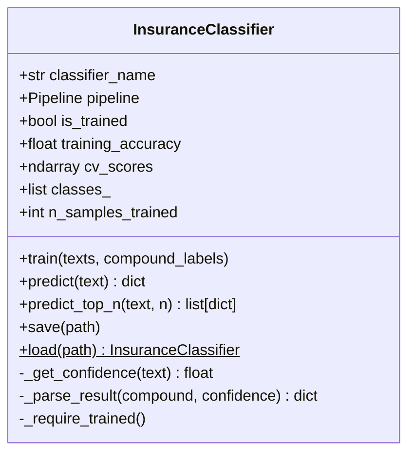

#### Pipeline construction — `_build_pipeline(classifier_name)`

Each algorithm is implemented as a two-step scikit-learn `Pipeline` (vectorizer → estimator):

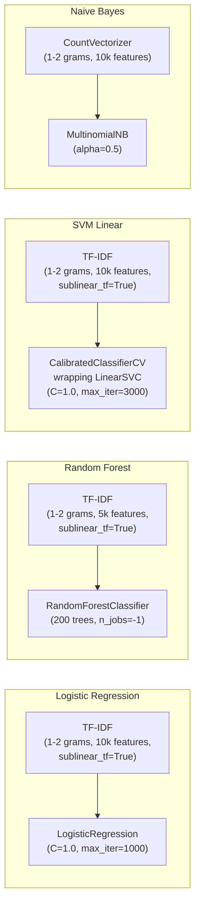

> **SVM calibration:** `LinearSVC` does not natively expose `predict_proba`. It is wrapped in `CalibratedClassifierCV` (Platt scaling, cv=3) so probability scores are available for confidence display and top-N ranking.

> **Naive Bayes vectorizer:** `MultinomialNB` requires non-negative integer input, so `CountVectorizer` (raw term counts) is used instead of TF-IDF for this algorithm only.

#### Training and cross-validation

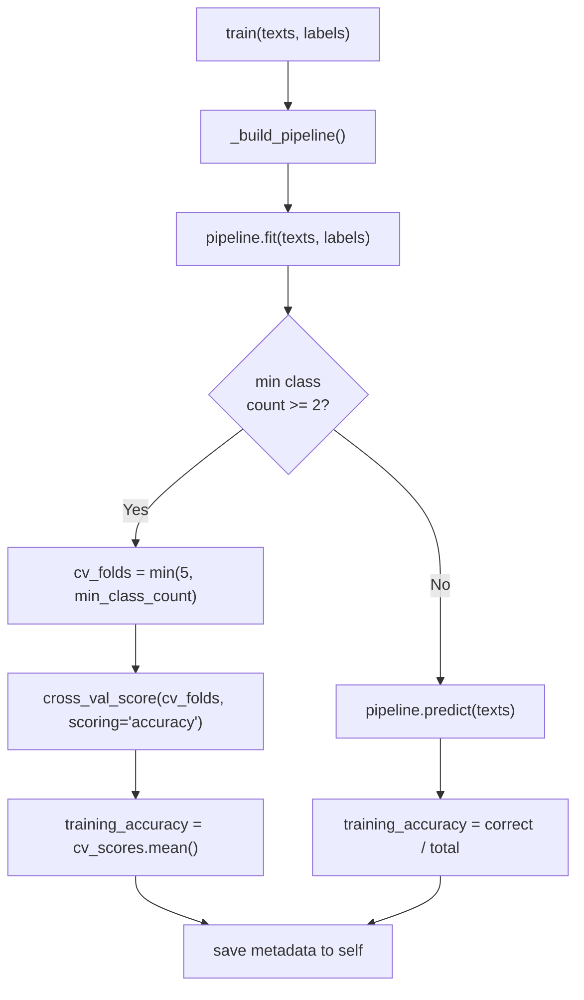

The number of cross-validation folds is capped at `min(5, min_class_count)` so that classes with few examples never produce empty test folds.

#### Prediction output schema

```python
{
    "category":       "Claims",
    "subcategory":    "Medical Records",
    "compound_label": "Claims|Medical Records",
    "confidence":     0.87,          # None if algorithm has no predict_proba
}
```

---

### 4.5 Storage — `src/storage.py`

A **flat-file JSON store** for training samples. All reads and writes go through this module; `app.py` and other modules never touch the filesystem directly.

**File location:** `data/training_data.json` (relative to the project root, auto-created on first write)

**Public API:**

| Function | Description |
|---|---|
| `load_training_data()` | Read and return all samples as a list of dicts |
| `add_training_sample(text, filename, category, subcategory, keywords)` | Append one sample, write to disk, return the new sample |
| `delete_training_sample(sample_id)` | Remove a sample by UUID, write to disk |
| `clear_all_training_data()` | Overwrite the file with an empty list |
| `get_all_categories(include_defaults)` | Union of stored categories and `DEFAULT_CATEGORIES` |
| `get_subcategories_for(category, include_defaults)` | Union of stored subcategories and `DEFAULT_SUBCATEGORIES[category]` |

---

### 4.6 Defaults — `src/defaults.py`

Provides the **built-in insurance taxonomy** so new users see a useful starting point without any training data.

**6 default categories, each with 6–8 subcategories:**

```
Policy          → Auto Policy, Home/Property Policy, Health Policy, Life Policy,
                  Commercial/Business Policy, Liability Policy, Workers Compensation, Other
Claims          → Claim Form, Medical Records, Police/Incident Report, Adjuster Report,
                  Settlement Agreement, Proof of Loss, Damage Photos, Other
Underwriting    → Application Form, Risk Assessment, Inspection Report,
                  Loss History/Loss Run, Questionnaire, Other
Financial       → Premium Invoice, Payment Receipt, Loss Run Report,
                  Financial Statement, Audit Report, Other
Legal           → Endorsement, Rider/Amendment, Exclusion Notice,
                  Contract/Agreement, Power of Attorney, Subrogation Letter, Other
Correspondence  → Cancellation Notice, Renewal Notice, Demand Letter,
                  Coverage Update, Declination Letter, Other
```

These defaults are merged with user-created categories at runtime (`get_all_categories`, `get_subcategories_for`), so custom categories coexist with built-in ones without any extra configuration.

---

## 5. Data Flows

### 5.1 Training Flow

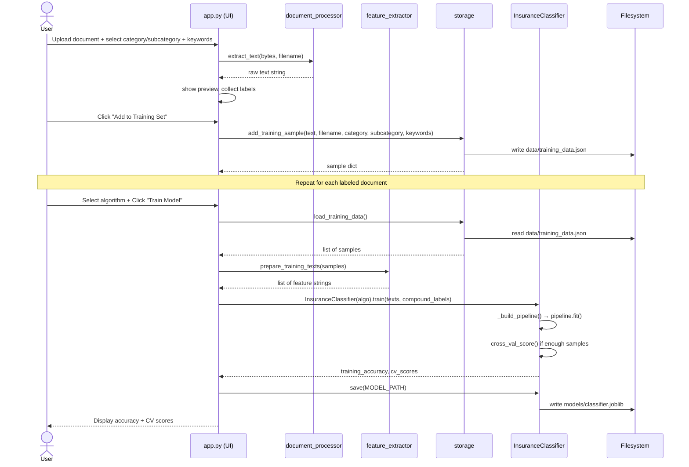

### 5.2 Prediction Flow

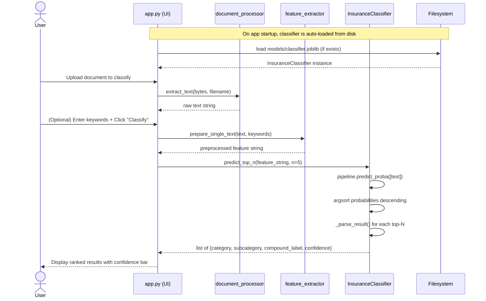

---

## 6. ML Pipeline Architecture

Every algorithm shares the same two-stage pipeline structure:

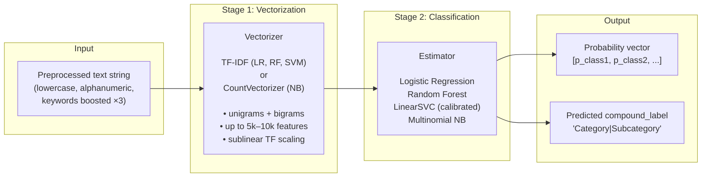

**Compound label encoding:** The two-level taxonomy (`Category|Subcategory`) is flattened into a single string label (`"Claims|Medical Records"`) before training. After prediction, `_parse_result` splits on `"|"` to recover both levels. This lets any standard single-label classifier handle the hierarchical taxonomy without modification.

---

## 7. Data Model

### Training Sample (JSON record)

```json
{
  "id":             "f47ac10b-58cc-4372-a567-0e02b2c3d479",
  "filename":       "claim_form_q1.pdf",
  "text":           "patient name john smith date of service 2024 01 15 ...",
  "category":       "Claims",
  "subcategory":    "Medical Records",
  "keywords":       ["medical", "claim number", "diagnosis"],
  "compound_label": "Claims|Medical Records",
  "timestamp":      "2026-06-22T14:23:01.456789"
}
```

### Serialized Model (`models/classifier.joblib`)

```python
{
    "pipeline":          Pipeline,      # fitted sklearn Pipeline object
    "classifier_name":   str,           # e.g. "Logistic Regression"
    "is_trained":        bool,
    "training_accuracy": float,         # mean CV accuracy or training accuracy
    "cv_scores":         np.ndarray,    # per-fold scores, or None
    "classes_":          list[str],     # all compound labels seen during training
    "n_samples_trained": int,
}
```

### Entity-Relationship Overview

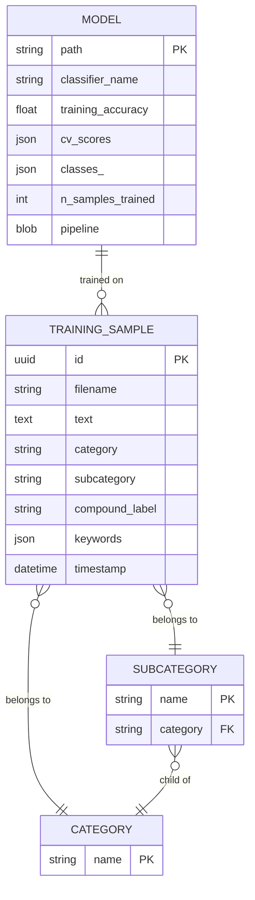

---

## 8. UI Application Structure

### Page Layout

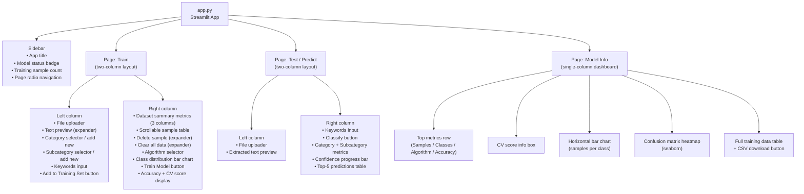

### Session State

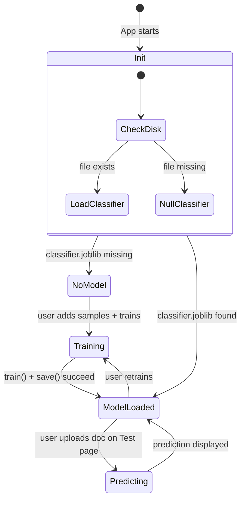

**Session state keys:**

| Key | Type | Description |
|---|---|---|
| `classifier` | `InsuranceClassifier \| None` | Active trained model |
| `train_text` | `str \| None` | Extracted text from training upload |
| `train_filename` | `str \| None` | Filename of training upload |
| `test_text` | `str \| None` | Extracted text from prediction upload |

---

## 9. Directory Structure

```
aiops/
├── app.py                        # Streamlit entry point & UI orchestration
├── requirements.txt              # Python dependency pinning
│
├── src/                          # Core business logic package
│   ├── __init__.py
│   ├── classifier.py             # InsuranceClassifier + pipeline factory
│   ├── defaults.py               # Built-in insurance taxonomy
│   ├── document_processor.py     # Multi-format text extraction
│   ├── feature_extractor.py      # Text preprocessing + keyword boosting
│   └── storage.py                # JSON-based training data CRUD
│
├── data/                         # Created automatically on first write
│   └── training_data.json        # Labeled training samples (flat JSON array)
│
└── models/                       # Created automatically on first train
    └── classifier.joblib         # Serialized sklearn Pipeline + metadata
```

---

## 10. Configuration & Deployment

### Running locally

```bash
pip install -r requirements.txt
# Install Tesseract for image/OCR support:
#   macOS:  brew install tesseract
#   Ubuntu: sudo apt-get install tesseract-ocr
#   Windows: https://github.com/UB-Mannheim/tesseract/wiki

streamlit run app.py
```

Streamlit opens a browser tab at `http://localhost:8501` by default.

### Environment requirements

| Requirement | Notes |
|---|---|
| Python 3.14+ | Uses `X \| Y` union type hints natively |
| Tesseract binary | Only needed if classifying scanned image files |
| ~200 MB disk | scikit-learn + pandas + pdfplumber |
| No GPU required | All ML is CPU-based |
| No network access | Fully offline after `pip install` |

### Hardcoded paths

Both paths are relative to the project root and constructed with `pathlib.Path`:

```python
# app.py
MODEL_PATH = str(Path(__file__).parent / "models" / "classifier.joblib")

# src/storage.py
_DATA_DIR      = Path(__file__).parent.parent / "data"
_TRAINING_FILE = _DATA_DIR / "training_data.json"
```

Both directories are created automatically (`mkdir(exist_ok=True)`) on first write, so no manual setup is needed.

---

## 11. Feature Engineering Deep Dive

The feature engineering pipeline is intentionally simple but effective for domain-specific document classification:

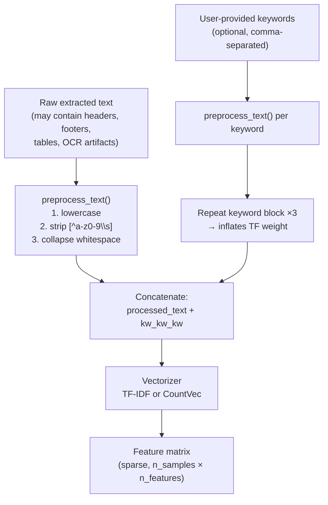

**Why keyword boosting works with TF-IDF:**
TF-IDF scores are proportional to term frequency within a document. By repeating keywords three times in the feature string, those tokens receive a TF multiplier of approximately 3×, making them stronger discriminators without needing to modify the vectorizer or introduce custom weights. This is a lightweight but effective human-in-the-loop signal.

---

## 12. Classification Algorithms Compared

| Property | Logistic Regression | Random Forest | SVM Linear | Naive Bayes |
|---|---|---|---|---|
| Vectorizer | TF-IDF | TF-IDF | TF-IDF | CountVectorizer |
| Max features | 10,000 | 5,000 | 10,000 | 10,000 |
| N-grams | (1,2) | (1,2) | (1,2) | (1,2) |
| Sublinear TF | Yes | Yes | Yes | No |
| Native `predict_proba` | Yes | Yes | No (calibrated) | Yes |
| Parallelism | No | Yes (`n_jobs=-1`) | No | No |
| Best for | General baseline, interpretable | Larger datasets, robust | High-dimensional text | Very small datasets |
| Typical speed | Fast | Slower (200 trees) | Fast | Very fast |
| Confidence quality | Good | Good | Via Platt scaling (approximate) | Often overconfident |

---

## 13. Error Handling & Edge Cases

| Scenario | Handling |
|---|---|
| Unsupported file extension | `ValueError` raised in `extract_text`, shown as `st.error` |
| Tesseract not installed | `RuntimeError` with installation instructions |
| Corrupt PDF/DOCX | Exception caught in `app.py`, shown as `st.error` |
| Fewer than 2 training samples | UI warning, Train button disabled |
| Single-class training data | UI warning; training requires ≥ 2 distinct compound labels |
| Min class count = 1 | Cross-validation skipped; training accuracy used instead |
| Missing model file on startup | `_load_classifier_from_disk` returns `None`; sidebar shows warning |
| Corrupt model file | `try/except` around `InsuranceClassifier.load`, returns `None` |
| Classifier without `predict_proba` | `predict_top_n` falls back to `predict` (returns single result) |

---

## 14. Extension Points

The codebase has several natural extension points that require minimal changes:

| Extension | Where to change | Notes |
|---|---|---|
| Add a new ML algorithm | `classifier.py: _build_pipeline()` + `ALGORITHM_NAMES` list | One new `elif` branch |
| Add a new file format | `document_processor.py: SUPPORTED_EXTENSIONS` + `extract_text()` | One new `elif` and extraction function |
| Switch to a database backend | `storage.py` only | Replace JSON read/write with SQLite or PostgreSQL; public API is unchanged |
| Add new default categories | `defaults.py: DEFAULT_CATEGORIES` + `DEFAULT_SUBCATEGORIES` | No other changes needed |
| REST API wrapper | Wrap `classifier.predict` and `document_processor.extract_text` in FastAPI | Core logic is already decoupled from Streamlit |
| Multi-user support | Replace session state + local files with per-user storage | Requires auth layer and user-scoped file paths |
| Fine-tuned LLM classifier | Implement a new class with the same `train` / `predict` / `save` / `load` interface | Drop-in replacement for `InsuranceClassifier` |
